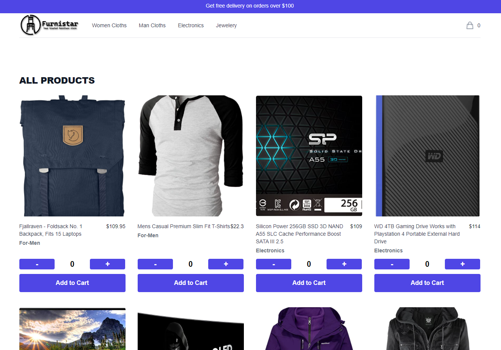
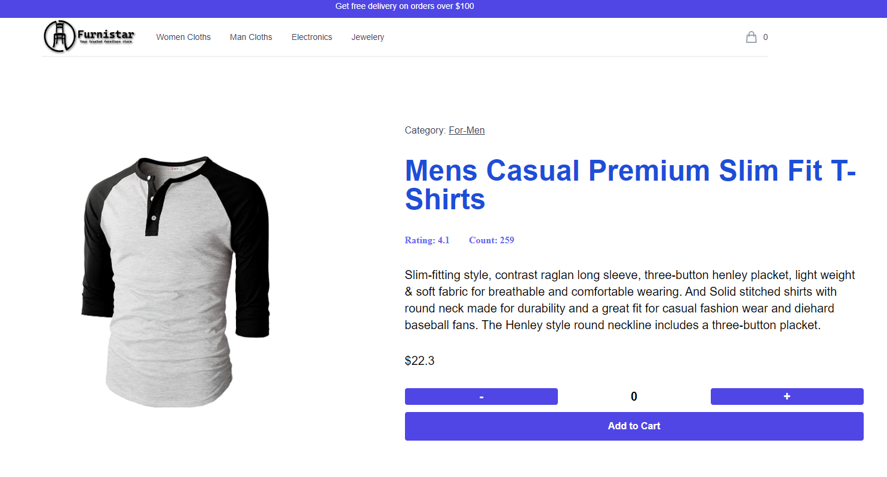
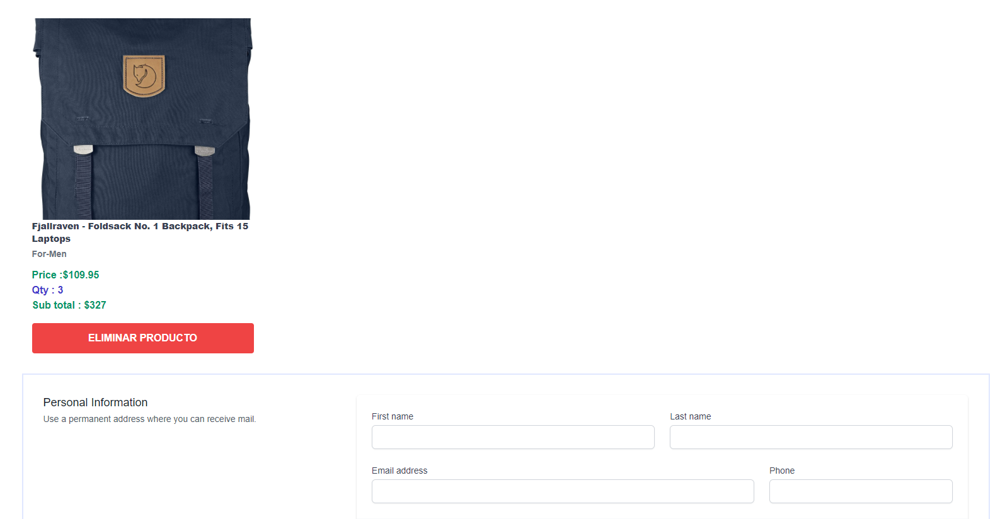
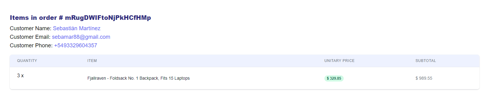

# React-Tailwind-Ecommerce CoderHouse

[](https://app.netlify.com/sites/react-tailwind-ecommerce/deploys)

_Social buttons_

[](https://github.com/sebamar88/react-tailwind-ecommerce "Go to GitHub repo")
[](https://github.com/sebamar88/react-tailwind-ecommerce)
[](https://github.com/sebamar88/react-tailwind-ecommerce)

_Repo metadata_

[](https://github.com/sebamar88/react-tailwind-ecommerce/releases/)
[](#license)

_Call-to-Action buttons_

<div align="center">

</div>

## License

Released under [MIT](/LICENSE) by [@sebamar88](https://github.com/sebamar88).

### Version 1 :

- The data is stored on Firestore
- It is hosted [HERE!](react-tailwind-ecommerce.netlify.app/)

An E commerce platform made using React JS, Context, Firebase , Firestore & Tailwind

The application is composed of the following Features:

### Front-End

- A landing page with animated minimalistic design, with the major categories of items.
- A quick peek page where 5 products of each categories are on display.
- A page with Sign-in and Sign-out components.
- All form related fields are made using reusable components.
- Has a cart feature which opens up and displays the items selected in a summary, also has a checkout button.
- The cart component also allows to edit the contents of the items selected.
- Check out features are yet to be integrated into the appplication.

### Firebase

- At the moment firebase is used to call the products in the store.
- It is also used to store order data

**SCREENSHOTS:**

Landing Page:

## 

Product Details:

## 

Cart Section:



Order Details:

## 

## Developed With

- [Visual Studio Code](https://code.visualstudio.com/) - A source code editor developed by Microsoft for Windows, Linux and macOS. It includes support for debugging, embedded Git control, syntax highlighting, intelligent code completion, snippets, and code refactoring
- [React](https://reactjs.org/) - A javascript library for building user interfaces
- [Create react app](https://create-react-app.dev/) - A quick method to start developing a react application.
- [Babel](https://babeljs.io/) - A transpiler for javascript
- [Webpack](https://webpack.js.org/) - A module bundler
- [SCSS](http://sass-lang.com/) - A css metalanguage
- [Tailwind](https://tailwindcss.com/) - A css framework
- [HeroIcons](https://heroicons.com/) - An icon library

---

## Getting Started

These instructions will get you a copy of the project up and running on your local machine for development and testing purposes.

### Prerequisites

The following software is required to be installed on your system:

- Node 8.x
- Npm 3.x

Type the following commands in the terminal to verify your node and npm versions

```bash
node -v
npm -v
```

### Install

Follow the following steps to get development environment running.

- Clone _'react-tailwind-ecommerce.git'_ repository from GitHub

  ```bash
  git clone https://github.com/sebamar88/react-tailwind-ecommerce.git
  ```

  _OR USING SSH_

  ```bash
  git clone https://github.com/sebamar88/react-tailwind-ecommerce.git
  ```

- Install node modules

  ```bash
  npm install
  ```

### Starting front-end servers

- Build application

  ```bash
  npm start
  ```

---
